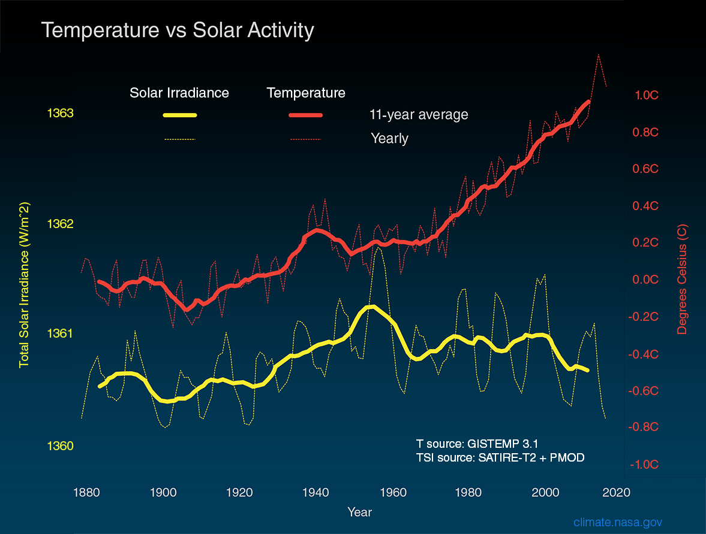

```{r setup, include=FALSE}
library(leaflet)
library(sf)
emas <- st_read('data/spatial/emas/emas.shp')

options(htmltools.dir.version = FALSE)
library(xaringanthemer)
mono_light(title_slide_background_color = 'grey',
           background_image = 'img/logo_hemera.png',
           background_size = '10%',
           background_position = '95% 5%',
           code_inline_color = 'red',
           code_font_google =  google_font("Work Sans", "300", "300i"),
           link_color = 'darkred' )
```
---
class: center, middle, inverse

# Clima y Cambio Climático

---
# Clima

Tiempo vs clima

Tiempo: corto plazo

Clima: largo plazo. 

Una forma de recordarlo: 

>El tiempo te dice qué ponerte en un día determinado. El clima te indica qué guardarropa debes tener.

---
# Clasificación del clima

¿Por qué clasificarlo?

Nos ayuda a conocer las condiciones que una región experimenta durante el año. En vez de tener que describir todas las condiciones observadas en una región durante un mes o temporada del año, un esquema de clasificación puede comunicar las condiciones esperadas utilizando solo dos o tres términos.

¿Cómo lo podemos clasificar?

Existen varios esquemas de clasificación del clima.

Basados en:

**`Precipitación y temperatura`**

Precipitación y evapotranspiración

Características ambientales

---
# Clasificación de Köppen-Geiger

.center[]

---
# Clima de Chile


.center[]

---
# Clima de Chile

.center[]

---
# Clima de Chile

.center[]

---
# Clima de Chile

.center[]

---
# Cambio Climático

**Causas**

.center[]

---
# Cambio Climático

**Evidencia**

.center[]

---
# Cambio Climático

**Evidencia**

.center[]

---
# Cambio Climático

**Cambio en los patrones de Temperatura y precipitación**

.center[]

---
class: center, middle, inverse

# Impactos del Cambio Climático en la Agricultura

---
# Precipitación

.center[]

---
# Precipitación

.center[]

---
# Caudales

.center[]

---
# Embalses

.center[]

---

# Sequia

.center[]
.center[]

---
# Sequía

.center[]

---
# Sequía

.center[]

---
# Sequía

.center[]

---
background-image: url("gif/thatsall.gif")
background-position: center
background-size: contain