```{r setup, include=FALSE}
library(leaflet)
library(sf)
emas <- st_read('data/spatial/emas/emas.shp')

options(htmltools.dir.version = FALSE)
library(xaringanthemer)
mono_light(title_slide_background_color = 'grey',
           background_image = 'img/logo_hemera.png',
           background_size = '10%',
           background_position = '95% 5%',
           code_inline_color = 'red',
           code_font_google =  google_font("Work Sans", "300", "300i"),
           link_color = 'darkred' )
```

# ¿Que veremos?

- `14:00` Puntos varios-Inquietudes-Evaluaciones

- `14:10`	Conección con clase anterior (Moderadores)-Presentación Porfesor

- `14:15`	Inicio Clase: **`Clima y Cambio Climático`**
  1. `El ambiente`

  2. `Clima y Cambio Climático`

  3. `Impactos del Cambio Climático en la Agricultura`

- `14:55`	Término clase-Preguntas y dudas Clase

- `15:10`	Inicio Control

- `15:20`	Término Control-Término Clase

- `Post-Clase`	Encuesta Clase

---
class: center, middle, inverse

# El ambiente

---
# La tierra

.center[]

---
# Ciclo Hidrológico

.center[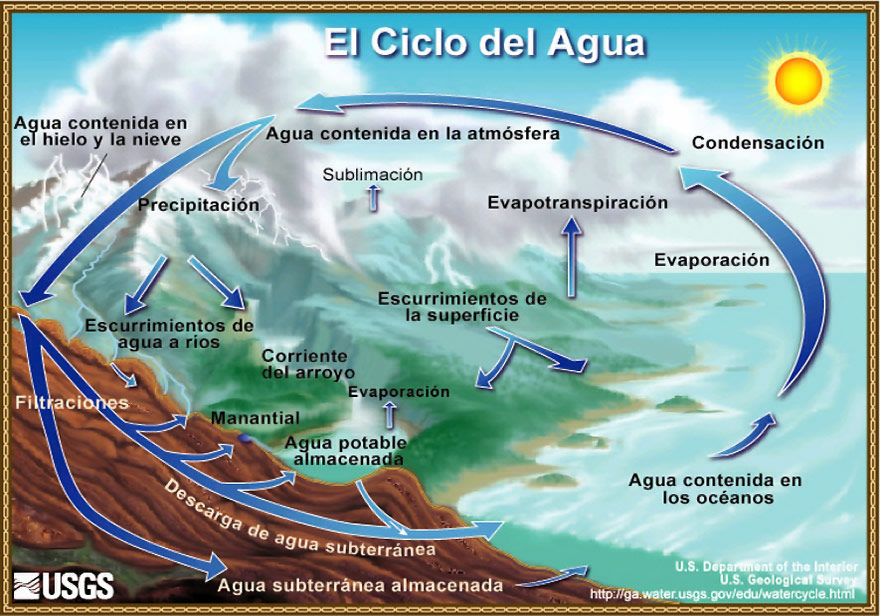]

---
# Variables ambientales

.center[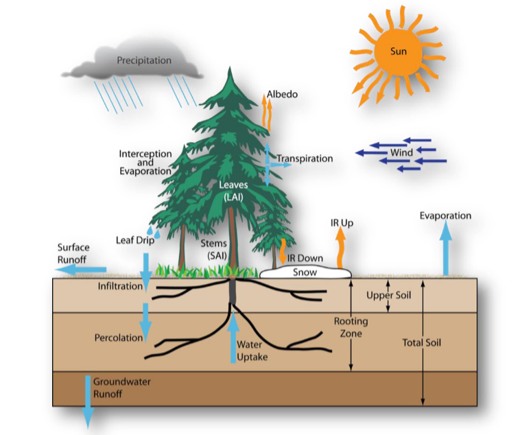]

---
# Procesos en la planta

.center[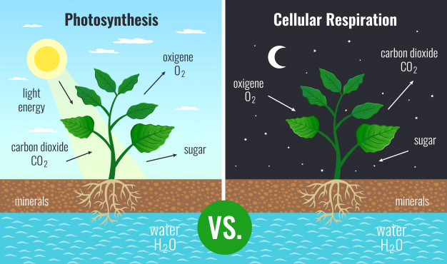]

---
# Procesos en la planta

.center[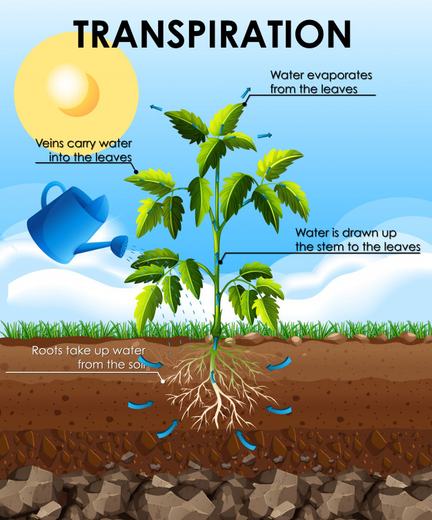]

---
# Principales variables ambientales

1. Precipitación 

2. Temperatura 

3. Luminocidad

4. Humedad relativa

5. Velocidad del viento

6. Humedad de suelo

7. Evapotranspiración 

---
# Precipitación

Es `cualquier forma de hidrometeóro` que cae de la atmósfera y llega a la superficie terrestre. 

Ej: Lluvia, nieve, granizo, ..

**`Precipitación efectiva:`** agua que puede ser usada por la planta

.center[]

---
# Temperatura

`Una medida de la intensidad de calor`

- Determinante para el desarrollo de la planta y cambio de estado fenológico.

  - `Grados día`:Acumulación de temperatura sobre un umbral (5°C, 10°C, 12°C)

`Temperatura mínima:` peligro de helada

`Temperatura máxima:` sobre un umbral la planta deja de crecer

La temperatura afecta directamente la: 
  - fotosíntesis 
  - respiración 
  - transpiración 
  - absorción de agua y nutrientes

---
# Temperatura

.center[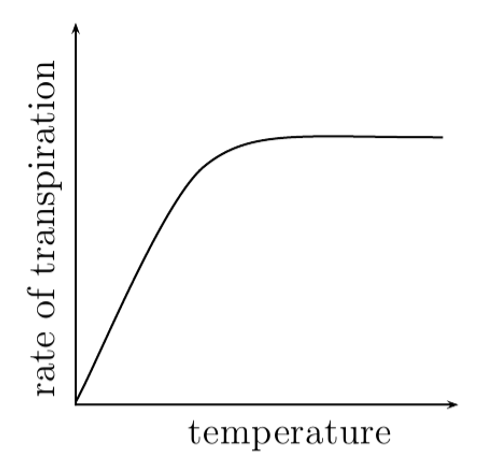]
---
# Temperatura

.center[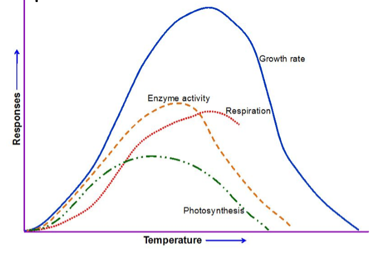]

---
# Temperature

.center[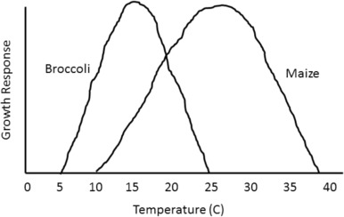]

---

# Luminocidad

Es uno de los principales factores que afecta la `apertura de estomas`. Impacta la fotosíntesis.

.center[]

---
# Humedad Relativa (HR)

**`Humedad relativa:`** Relación entre la cantidad de vapor de agua que tiene una masa de aire y la máxima que podría tener. Se mide en (%).

`HR:` Regula la tasa de transpiración de las plantas por medio de la apertura y cierre de estomas.

.center[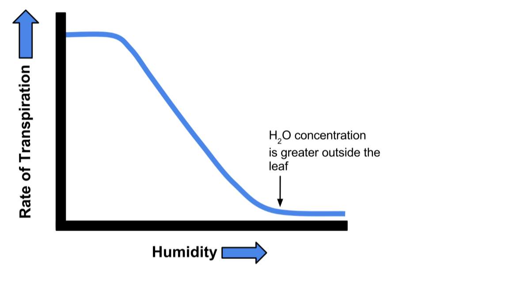]

---
# Velocidad de Viento

Cuando hay viento, el aire húmedo es reemplazado por aire más seco porque el viento desplaza el aire húmedo.

.center[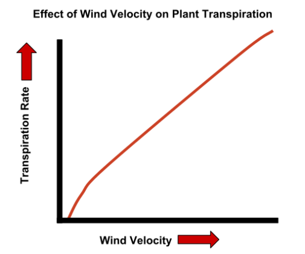]

---
# Transpiración


.center[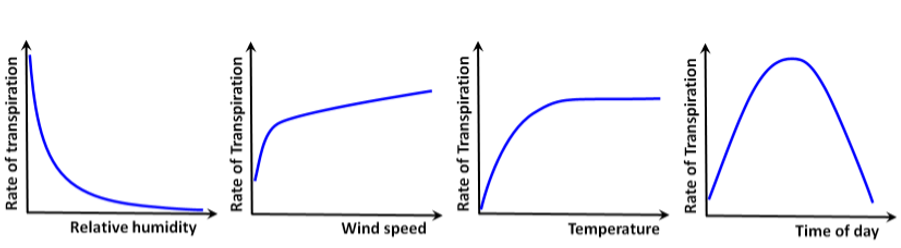]

---
# Humedad de suelo

.center[]

---
# Humedad de suelo

Entre las propiedades físicas del suelo de mayor importancia para la transferencia de agua se encuentran:

**`textura:`**  indica el contenido relativo de partículas de diferente tamaño, como la arena, el limo y la arcilla, en el suelo.

**`estructura:`** se define por la forma en que se agrupan las partículas individuales de arena, limo y arcilla.

**`porosidad:`**  se refiere al porcentaje del volumen del suelo no ocupado por sólidos

---
# Evapotranspiración

.center[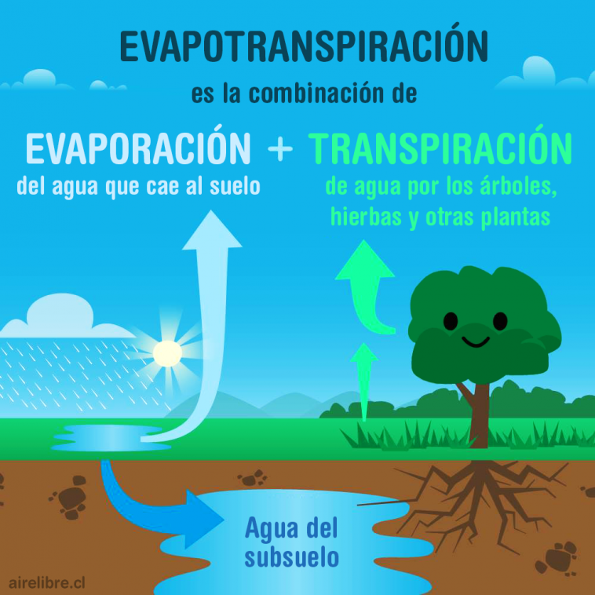]

---
# ¿Cómo medimos las variables climáticas?
--

`Estación (agro)meteorológica`

.center[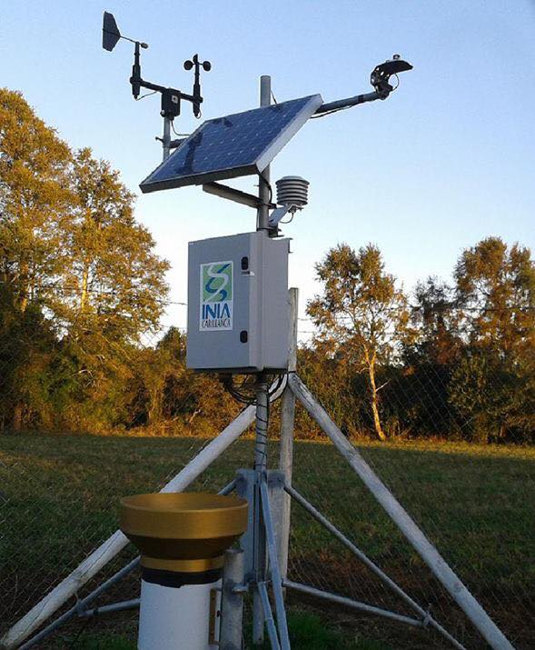]

---
# ¿Dónde se encuentran ubicadas?

```{r, echo=FALSE,fig.width=10}
pal <- colorFactor(c("darkblue", "darkred"), domain = emas$institucio)

leaflet() %>% 
  addProviderTiles('Esri.WorldImagery') %>%
  addMarkers(data=st_transform(emas,4326),
             popup = ~as.character(institucio), 
             label = ~as.character(estacion)) %>% 
  setView(lng=-70.7,lat= -33.5, zoom = 6) 
```
